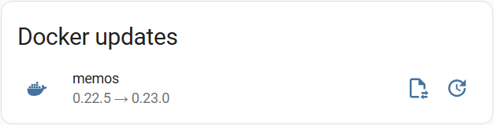

# docker-update

Keep your Docker containers up-to-date using [wud](https://getwud.github.io/wud/) and [Home Assistant](https://www.home-assistant.io/)  
Designed to offer low-maintenance and high reliability and security

### Features
- Automatic installation of patch level updates
- Get informed about updates that might require your attention: Check the changelog for breaking changes and approve updates manually in your Home Assistant dashboard
- Adapt to your specific needs using the power of Home Assistant automations

This solution works both with dynamic (such as `latest`) and specific (e.g. `1.5.1`) version tags.

## Requirements
- Docker Compose based system for your containers
- A Home Assistant instance running in your network

Recommendation: If you want to use Docker Compose but would like to have a GUI, [Dockge](https://dockge.kuma.pet/) might be the best way to manage all your containers.

## MQTT
Setting up MQTT is necessary to get notifications in Home Assistant. If you are not using MQTT already, you can follow [this excellent guide](https://www.homeautomationguy.io/blog/docker-tips/configuring-the-mosquitto-mqtt-docker-container-for-use-with-home-assistant) to get instructions how to install Mosquitto as a Docker container on your system.

## wud
[wud](https://getwud.github.io/wud/) (previously *What's Up Docker?*) is a great tool to implement our goals. Although its usability could be improved and its setup requires quite some effort, especially if you are running a lot of services, it's worth definitely it.

Follow the installation instructions as described [here](https://getwud.github.io/wud/#/quickstart/) to get started. After you verified the successful setup by accessing the GUI, you can proceed to configure it.

First, we'll need to expose the volume in which the Docker Compose files are stored by adding this to the wud compose file:

```
volumes:
  - ./docker-compose:/compose
```

Now it's time to understand how wud works:  
+ __Watchers__ monitor your Docker containers for changes, such as updates, restarts, or new versions.  
+ __Triggers__ define actions to execute when watchers detect a relevant change like sending notifications.

Watchers and trigger are configured in the enviroment variables of the wud container with the following scheme:  
`WUD_{TYPE}_{NAME}_{PARAMETER}`

### Watchers
Containers will be monitored by a watcher, which we'll simply call `LOCAL`. You should add your timezone and configure the cron job for the file system watcher to limit how often a check for new versions is performed. The default setting is once every hour, but this frequency is not really necessary and could lead to rate limits if you have a lot of containers. An update check once every 6 hours (4 times a day) should be sufficient, but you can change this if you want to check for updates more or less often.

```
environment:
  TZ: Europe/Berlin
  WUD_WATCHER_LOCAL_CRON: 0 */6 * * *
```

There are additional settings that you might want to change from the default setting, but this is not required:  

| Parameter        | Default | Meaning                              |
| --------         | ------- | -------                              |
| `WATCHALL`       | false   | Monitor running + stopped containers |
| `WATCHBYDEFAULT` | true    | Monitor all containers by default    |

### Triggers
There's a [wide range of triggers](https://getwud.github.io/wud/#/configuration/triggers/) available that you can configure in addition to this if you want to use more or other methods.
We'll use MQTT to send updates to get notifications about the status of our Docker containers in Home Assistant. Add these variables to your compose file and replace `ip`, `username` and `password` with the correct values for your broker.

```
environment:
  WUD_TRIGGER_MQTT_MOSQUITTO_URL: mqtt://ip:1883
  WUD_TRIGGER_MQTT_MOSQUITTO_USER: username
  WUD_TRIGGER_MQTT_MOSQUITTO_PASSWORD: password
  WUD_TRIGGER_MQTT_MOSQUITTO_HASS_ENABLED: true
  WUD_TRIGGER_MQTT_MOSQUITTO_HASS_DISCOVERY: true
  WUD_TRIGGER_MQTT_MOSQUITTO_THRESHOLD: minor
```

The actual updates to the compose files will be handled by the dockercompose trigger. This part might be quite exhaustive as we need to add two triggers for every compose file to facilitate automatic updates for patches and manual updates for larger updates. Add these variables to you compose file and set the threshold to your desired level (`patch`, `minor`, `major`, `all`). With this configuration, old images are deleted from your drive after an update has been applied.

```
environment:
  WUD_TRIGGER_DOCKERCOMPOSE_{SERVICE}-PATCH_FILE: /compose/{service}/compose.yaml
  WUD_TRIGGER_DOCKERCOMPOSE_{SERVICE}-PATCH_PRUNE: true
  WUD_TRIGGER_DOCKERCOMPOSE_{SERVICE}-PATCH_THRESHOLD: patch
  WUD_TRIGGER_DOCKERCOMPOSE_{SERVICE}-UPDATE_FILE: /compose/{service}/compose.yaml
  WUD_TRIGGER_DOCKERCOMPOSE_{SERVICE}-UPDATE_PRUNE: true
  WUD_TRIGGER_DOCKERCOMPOSE_{SERVICE}-UPDATE_THRESHOLD: major
  WUD_TRIGGER_DOCKERCOMPOSE_{SERVICE}-UPDATE_AUTO: false
```

### Labels
Finally, we'll need to let wud know what's the current version for our containers and provide ourselves with the changelog. For this, we'll need to add labels to every container that we want to manage using wud. Depending on what type of version tags you are using, you need to add different tags. To bolster security and fully make an advantage of this update system, it's recommended to make use of semantic versioning that is available for most popular containers. This way, you can make sure which version of software you are running and prevent updates with breaking changes from being installed.

__Dynamic tags__
```
labels:
  - wud.tag.include=latest
  - wud.watch.digest=true
```
Replace the include label with the dynamic tag that you're using if it's something else than `latest`. 

__Semantic tags__
```
labels:
  - wud.tag.include=^\d+\.\d+\.\d+$$
  - wud.link.template=https://github.com/{project}/{name}/tag/$${major}.$${minor}.$${patch}
```
Include and exclude labels are regex strings that determine eligible versions. If you're seeing versions that shouldn't match, adapt this string to your specific needs.
The changelog will be provided by the link template label – typically you can find it on the container's GitHub release page.

If you don't want a specific container to be watched, add `wud.watch=false` (given `WATCHBYDEFAULT` is `true`).

## Home Assistant
As we enabled auto-discovery, all the containers should now be available in Home Assistant at MQTT > wud. You can customize the entities with custom icons according to the service they are representing. For this, install [Simple Icons](https://github.com/vigonotion/hass-simpleicons) via [HACS](https://www.hacs.xyz/), then search for icons at https://simpleicons.org/ and set them as the icon using `si:` as prefix.

### Command
For the manual update of your containers, we'll need to run the dockercompose trigger using curl. Add this to your `configuration.yaml` file and make sure to replace `wud` with the correct IP address:
```
shell_command:
  update_container: curl -X POST http://wud:3000/api/containers/{{ container_id }}/triggers/dockercompose/{{ project }}-update
```
You can then call this action like so using attributes of the respective entity:
```
action: shell_command.update_container
data:
  container_id: [id]
  project: [labels_com_docker_compose_project]
```

### Dashboard



If you use the code below, you can add this card to your dashboard to manage pending container updates. Here, we're making use of three custom cards that you need'll to install using HACS:
1. [auto-entities](https://github.com/thomasloven/lovelace-auto-entities)
2. [config-template-card](https://github.com/iantrich/config-template-card)
3. [secondaryinfo-entity-row](https://github.com/custom-cards/secondaryinfo-entity-row)

Clicking on the first button will redirect you to the changelog for the current version, as defined by `wud.link.template` and if available. If you approve these changes, you can click on the second button to trigger the update.  
Keep in mind that this process may take some time and you won't see an update of the UI until the container has been updated successfully. However, you don't need to wait for one update to finish – it's possible to execute multiple updates simultaneously.

```
type: custom:auto-entities
card:
  type: entities
  title: Docker updates
filter:
  include:
    - domain: update
      device: wud
      state: "on"
      options:
        type: custom:config-template-card
        variables:
          name: states['this.entity_id'].attributes.name
          release_url: states['this.entity_id'].attributes.release_url
          container_id: states['this.entity_id'].attributes.id
          project: states['this.entity_id'].attributes.labels_com_docker_compose_project
        entities:
          - this.entity_id
        row:
          type: custom:secondaryinfo-entity-row
          entity: this.entity_id
          image: false
          name: ${name}
          state: ""
          secondary_info: >-
            {{ state_attr('this.entity_id', 'installed_version')}} → 
            {{ state_attr('this.entity_id', 'latest_version')}}
          extend_paper_buttons_row:
            hide_state: true
            buttons:
              - icon: mdi:file-arrow-left-right-outline
                tap_action:
                  action: url
                  url_path: ${release_url}
              - icon: mdi:update
                tap_action:
                  action: call-service
                  service: shell_command.update_container
                  service_data:
                    container_id: ${container_id}
                    project: ${project}
  exclude: []
sort:
  method: friendly_name
visibility:
  - condition: state
    entity: binary_sensor.wud_container_local_update_status
    state: "on"
```

> [!WARNING]
> I am aware of a bug with this card which causes traditional masonry dashboards to become blank entirely. In newer sections dashboards, only the card or parts of it are affected. If you edit the dashboard and save without changes, everything reappears. I suspect `config-template-card` to be the culprit as its last update stems from 2021 and I don't have a solution for this at the moment.

## Feedback
If you have questions or feedback, please open a discussion or raise an issue.